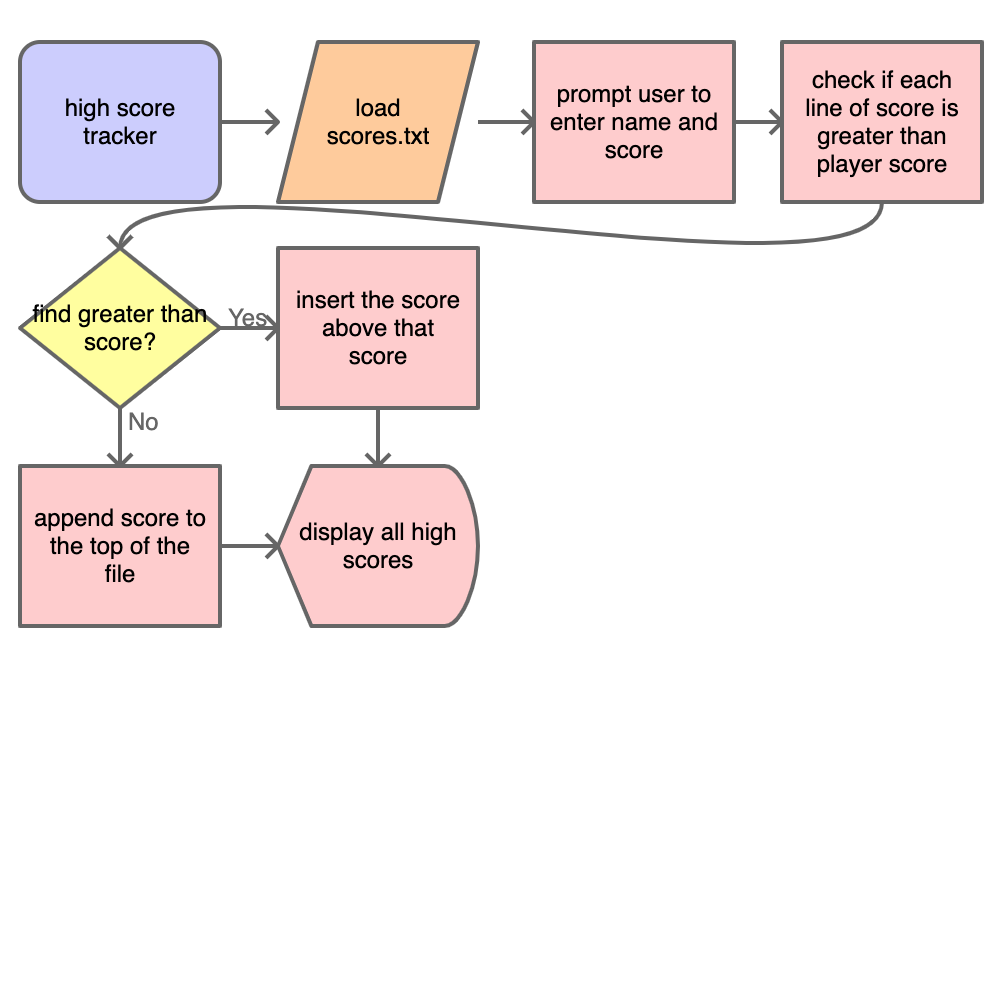
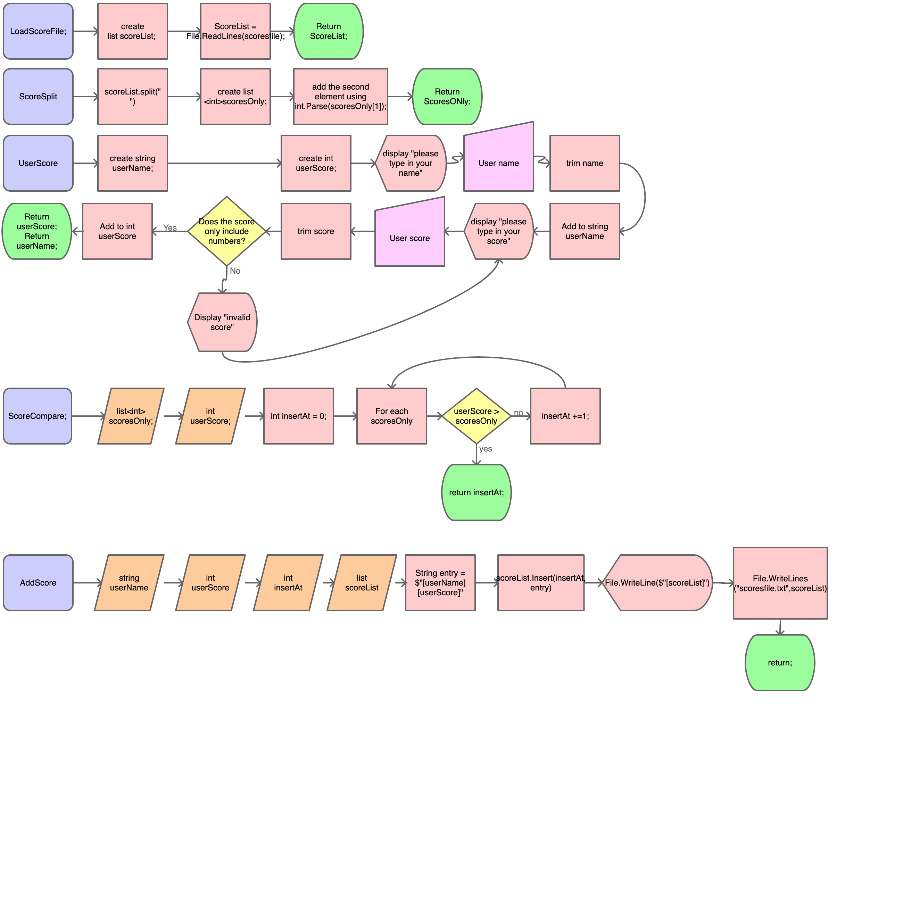

# Project Proposal
High Score Tracker
- [ ] List: txt w/ all current scores
- [ ] Player input: name and score
- [ ] Loop: checking where player lies in all scores
    - If letters in score, say "invalid input" 

## Overview
My program's purpose is to be a high score tracker. It takes the player's input and compares the player's high score to other high scores inputted, and based on the score inputs the score in order of score size (?). It then displays the list of scores from highest score to lowest score. The scores are stored in a text file. 
## High-level flowchart

## Methods
### LoadScoreFile(string scoresfile)
Loads the "scoresfile.txt" file and stores it in list "ScoreList". Returns "ScoreList". 
1. Create list scoreList
2. scorelist = file.ReadLines(scoresfile.txt);
3. return list scorelist
   
### ScoreSplit(list scoreList)
Loads the list "ScoreList" and takes the score values only. Returns int list "ScoresOnly". 
1. Split the scoreList along all spaces (" ")
2. create new list<int> = scoresOnly
3. add element 2 using int.Parse(scoresOnly[1]);
4. return list<int> scoresOnly;

### UserScore()
prompts the user's name and score values and stores them in two strings, "userScore" and "userName". The function returns these two strings.
1. create string userName
2. create int userScore
3. display "please type in your name"
4. collect user input
5. trim user input
6. add to string userName
7. start of loop: display "please type in your score"
8. collect user input
9. trim user input
10. if the score includes letters, display "invalid score" and restart the loop. If the score is only numbers, add the user input to integer userScore
11. Return int userScore, string userName

### ScoreCompare(List<int> scoresOnly, string userScore)
Takes the string "userscore" and compares it to the values in scoresOnly, stopping only when the userScore is greater than the value in an index of scoresOnly. It then returns the index number of the row where userScore was greater than scoresOnly in an integer "insertAt".
1. load list<int> scoresOnly and int userScore
2. create new int inserAt and set to 0
3. start of loop: for each line in scoresOnly--
4. if the user score is less than scoresOnly, increase int insertAt by one and restart the loop
5. if the user score is greater than scores only, return int insertAt
   
### AddScore(string userName, string<int> userScore, int insertAt, list scoreList)
Takes the "userName" and "userScore" strings, combines them into a string entry and inserts them into the list "scorelist" at the index specified by int "insertAt". It then displays all scores. 
1. Load in the userName, userScore, insertAt, and scoreList variables. 
2. Create String "entry" $"{userName} {userScore}"
3. Insert "entry" at index "insertAt" 
4. Using WriteLine, Display list scoreList
5. Using File.WriteLines, override all entries in scoresFile.txt to be entries in list scoreList
