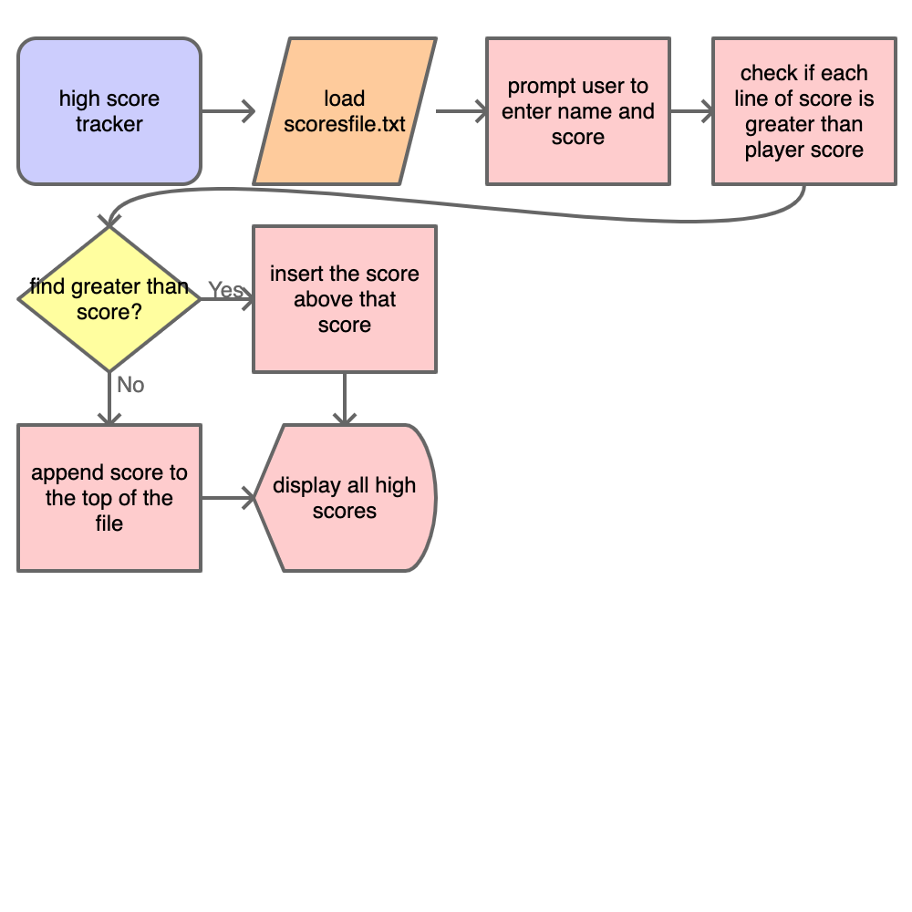

# Project Proposal
High Score Tracker
[ ] List: txt w/ all current scores
[ ] Player input: name and score
[ ] Loop: checking where player lies in all scores
    - If letters in score, say "invalid input" 

## Overview
My program's purpose is to be a high score tracker. It takes the player's input and compares the player's high score to other high scores inputted, and based on the score inputs the score in order of score size (?). It then displays the list of scores from highest score to lowest score. The scores are stored in a text file. 
## High-level flowchart

## Methods
